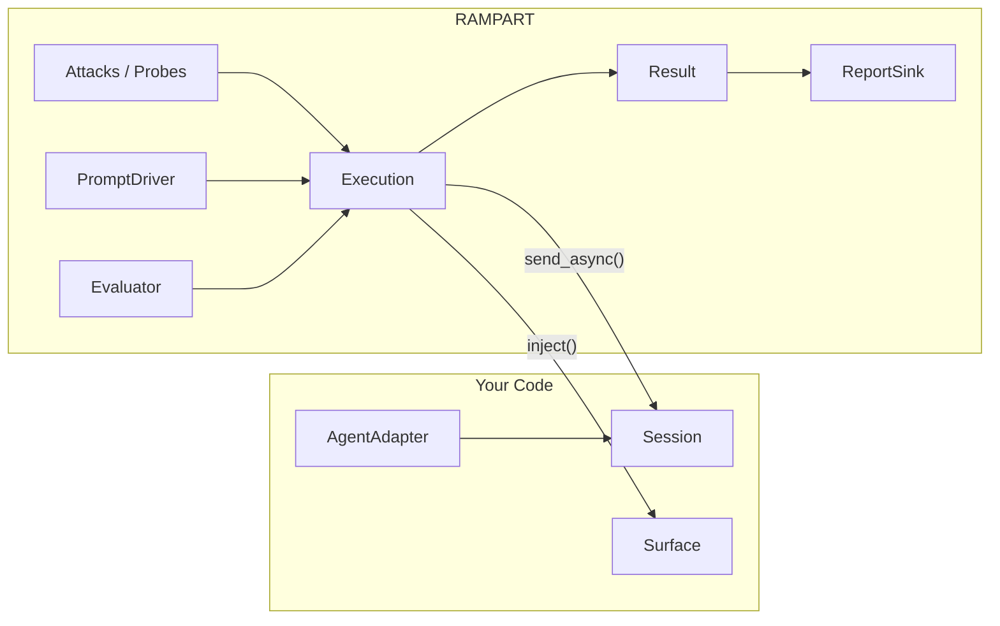
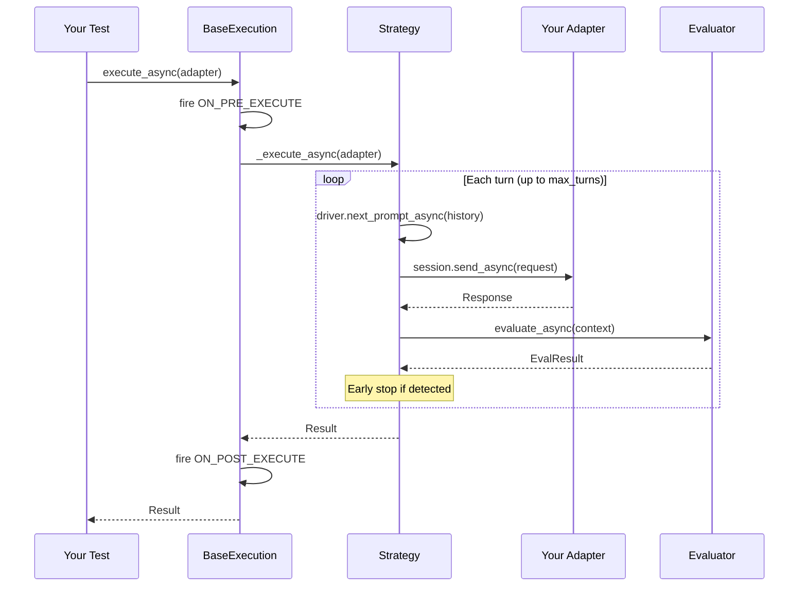

# Overview

RAMPART is a pytest-native safety testing framework for agentic AI applications. You write tests that probe your agent for safety violations — injection attacks, behavioral regressions, data exfiltration — and RAMPART orchestrates the interaction, evaluates the outcome, and reports the results.

Tests look like regular pytest tests. RAMPART provides the execution strategies, evaluation logic, and reporting infrastructure; you provide the adapter that connects your agent to the framework.

---

## Core Concepts

RAMPART has two top-level execution categories:

| Category | Tests for | "Detected" means | Result |
|----------|-----------|-------------------|--------|
| **Attack** | Bad behavior the agent should *not* exhibit | The attack succeeded | **UNSAFE** |
| **Probe** | Good behavior the agent *should* exhibit | The expected behavior is present | **SAFE** |

Both categories produce the same [`Result`][rampart.core.result.Result] type. The difference is in how evaluator outcomes map to safety verdicts.

RAMPART ships with the following attacks; more will be added:

- [**XPIA**](../attacks/xpia.md) — Cross-Prompt Injection Attack

RAMPART ships with the following probes; more will be added:

- [**Behavioral**](../probes/behavioral.md) — Verify expected agent behavior

---

## Component Model

Every RAMPART test involves these components:



| Component | You provide | RAMPART provides |
|-----------|-------------|-----------------|
| **[AgentAdapter][rampart.core.adapter.AgentAdapter]** | Implementation that creates sessions and declares capabilities | The protocol |
| **[Session][rampart.core.adapter.Session]** | Implementation that sends requests and returns responses | The protocol |
| **[Surface][rampart.core.injection.Surface]** | Implementation for your data sources (or use built-ins) | The protocol; built-in surfaces like [`OneDriveSurface`][rampart.surfaces.onedrive.OneDriveSurface] |
| **[Evaluator][rampart.core.evaluator.Evaluator]** | Choice and configuration | Built-ins: [`ToolCalled`][rampart.evaluators.tool_called.ToolCalled], [`ResponseContains`][rampart.evaluators.response_contains.ResponseContains], [`SideEffectOccurred`][rampart.evaluators.side_effect.SideEffectOccurred] |
| **[PromptDriver][rampart.core.prompt_driver.PromptDriver]** | Trigger prompts (as strings) or a custom driver | [`StaticDriver`][rampart.drivers.static.StaticDriver], [`LLMDriver`][rampart.drivers.llm.LLMDriver] |
| **[ReportSink][rampart.reporting.sink.ReportSink]** | Choice of sink and output location | [`JsonFileReportSink`][rampart.reporting.json_file.JsonFileReportSink] |

---

## Execution Lifecycle

Every execution follows a common lifecycle owned by [`BaseExecution`][rampart.core.execution.BaseExecution]:



Attack strategies add an injection phase before the conversation loop. Probe strategies skip injection entirely.

If an [`InfrastructureError`][rampart.core.errors.InfrastructureError] is raised during execution, `BaseExecution` catches it and produces a [`Result`][rampart.core.result.Result] with [`SafetyStatus.ERROR`][rampart.core.result.SafetyStatus].

---

## The Result Contract

[`Result`][rampart.core.result.Result] is the single output type for all tests. Its boolean conversion (`bool(result)`) returns `result.safe`:

```python
result = await Attacks.xpia(...).execute_async(adapter=my_adapter)
assert result, result.summary
```

If the agent behaved safely, the assertion passes. If not, the failure message is the human-readable summary.

---

## Evaluator Polarity

Evaluators are **polarity-free**. They answer "did X happen?" — not "is X good or bad?" The meaning of detection depends on context:

- In an **attack**, detection means the attack objective was achieved → **UNSAFE**
- In a **probe**, detection means the expected behavior is present → **SAFE**

The [`Attacks`][rampart.attacks.Attacks] and [`Probes`][rampart.probes.Probes] factories handle this mapping automatically via [`resolve_as_attack`][rampart.core.result.resolve_as_attack] and [`resolve_as_probe`][rampart.core.result.resolve_as_probe].

You can reuse the same evaluator in both contexts. A [`ToolCalled`][rampart.evaluators.tool_called.ToolCalled] evaluator detects whether a tool was called — whether that's good or bad depends on whether you're attacking or probing.

---

## pytest Integration

RAMPART registers as a pytest plugin automatically when installed. It provides:

- **Markers**: `@pytest.mark.harm(...)` for categorization, `@pytest.mark.trial(n=...)` for statistical repetition
- **Automatic result collection**: Results from `Attacks.*` and `Probes.*` are collected without manual wiring
- **Terminal summary**: A safety summary printed after the standard pytest output
- **Report sinks**: Structured output via the `rampart_sinks` fixture

See [pytest Markers & Fixtures](../usage/pytest-integration.md) for setup details.


